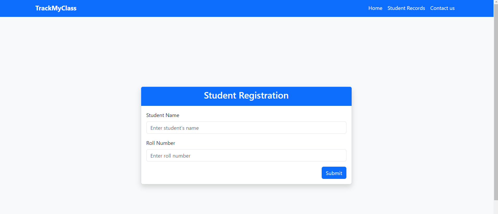
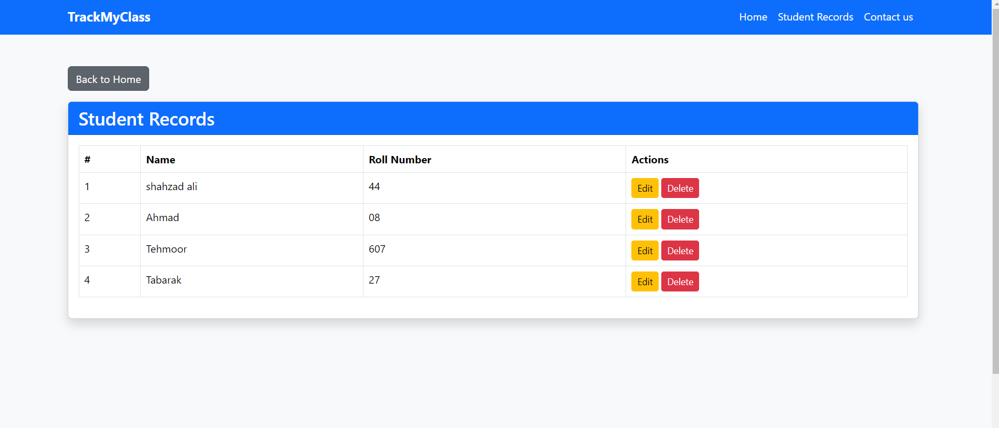
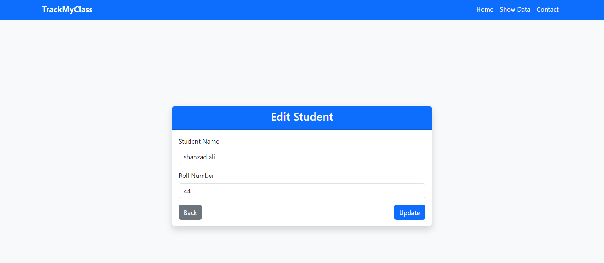
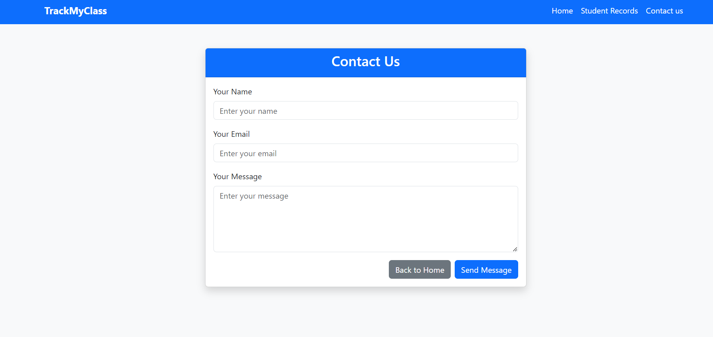

# TrackMyClass

TrackMyClass is a simple and efficient Laravel-based application for managing student records. This application allows teachers to keep track of students' names and roll numbers in a clean and user-friendly interface. It includes features like data storage, editing, deletion, and a contact page to reach administrators.


## Features

- **Student Registration**: Add student names and roll numbers through an intuitive form.
- **CRUD Functionality**:
  - **Create**: Register new students with their details.
  - **Read**: View the complete list of students.
  - **Update**: Edit existing student records.
  - **Delete**: Remove unwanted student records.
- **Responsive Design**: Built using Bootstrap, the interface is mobile-friendly.
- **Session Feedback**: Success and error messages for all actions.
- **Contact Form**: Allows users to send inquiries or messages to the admin email.
- **Validation**: Ensures all input fields are correctly filled before submission.


## Technologies Used

### Backend:
- [Laravel Framework](https://laravel.com/) - PHP framework for backend logic.

### Frontend:
- [Bootstrap](https://getbootstrap.com/) - For responsive design and styling.

### Database:
- [MySQL](https://www.mysql.com/) - Relational database for data storage.

### Email Service:
- Laravel's Mailer (using SMTP configuration) for sending emails through the contact form.


## Installation Instructions

### Prerequisites

Before you begin, ensure you have the following installed:
- PHP (>=8.1)
- Composer (Dependency Manager)
- MySQL
- A web server (e.g., Apache, Nginx, or Laragon for Windows)

### Steps

1. **Clone the Repository**:
   ```bash
   git clone https://github.com/Shahzad-Ali-44/TrackMyClass.git
   cd TrackMyClass
   ```

2. **Install Dependencies**:
   ```bash
   composer install
   ```

3. **Set Up Environment**:
   - Create a `.env` file by copying the example file:
     ```bash
     cp .env.example .env
     ```
   - Update the `.env` file with your database and mail settings:
     ```env
     DB_CONNECTION=mysql
     DB_HOST=127.0.0.1
     DB_PORT=3306
     DB_DATABASE=trackmyclass
     DB_USERNAME=your_username
     DB_PASSWORD=your_password

     MAIL_MAILER=smtp
     MAIL_HOST=smtp.gmail.com
     MAIL_PORT=587
     MAIL_USERNAME="your_email@gmail.com"
     MAIL_PASSWORD="your_password"
     MAIL_ENCRYPTION=tls
     MAIL_FROM_ADDRESS="your_email@gmail.com"
     MAIL_FROM_NAME="TrackMyClass"
     ADMIN_EMAIL="admin_email@example.com"
     ```

4. **Generate Application Key**:
   ```bash
   php artisan key:generate
   ```

5. **Run Migrations**:
   ```bash
   php artisan migrate
   ```

6. **Start the Development Server**:
   ```bash
   php artisan serve
   ```
   Open your browser and navigate to `http://localhost:8000`.


## Project Structure

```plaintext
TrackMyClass/
├── app/                 # Application core files (Models, Controllers)
├── bootstrap/           # Framework bootstrapping files
├── config/              # Configuration files
├── database/            # Migrations and seeds
├── public/              # Public assets (CSS, JS, images)
├── resources/           # Blade templates and raw assets
├── routes/              # Application routes
├── storage/             # Logs, cache, and uploaded files
├── tests/               # Unit and feature tests
├── .env.example         # Example environment configuration
├── composer.json        # PHP dependencies
├── package.json         # Node.js dependencies
└── artisan              # Artisan CLI
```


## Usage

### 1. **Student Management**
- **Add a Student**: Navigate to the home page, fill in the "Student Name" and "Roll Number" fields, and click "Submit".
- **View Students**: Access the "Student Records" page from the navigation bar to see a list of all students.
- **Edit Students**: Click the "Edit" button on the student record you wish to modify.
- **Delete Students**: Click the "Delete" button on the student record you wish to remove.

### 2. **Contact Form**
- Navigate to the "Contact" page to send inquiries to the admin email.
- Fill in the "Name", "Email", and "Message" fields and click "Send".


## Customization

1. **Change Admin Email**:
   Update the `ADMIN_EMAIL` in the `.env` file:
   ```env
   ADMIN_EMAIL="new_admin_email@example.com"
   ```


## Screenshots

### Home Page


### Student Records Page


### Edit Page


### Contact Page



## Contribution Guidelines

Contributions are welcome! Feel free to fork the repository, make improvements, and submit a pull request. To contribute:
1. Fork the repository.
2. Create a new branch for your feature/bug fix.
   ```bash
   git checkout -b feature-name
   ```
3. Commit your changes and push to your branch.
   ```bash
   git push origin feature-name
   ```
4. Open a pull request.


## License

This project is licensed under the [MIT License](LICENSE).

## Acknowledgments  
- Laravel framework for its powerful and elegant syntax.  
- Bootstrap for responsive and stylish design.  
- Laragon for simplifying the local development setup.  
- PHP community for continuous support and development tools.  

**TrackMyClass: Simplifying student management for educators with efficiency and ease.**  